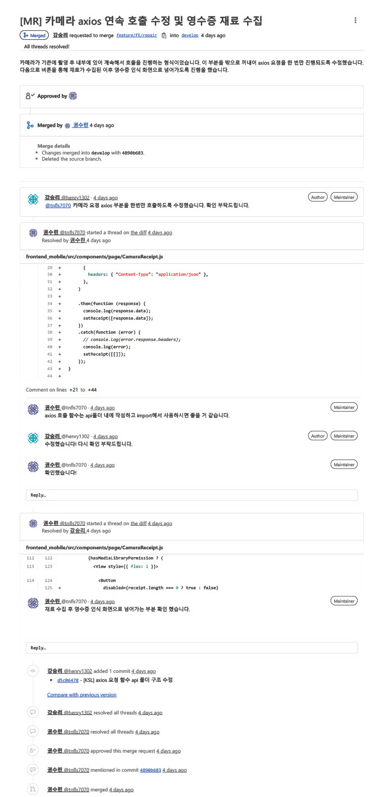
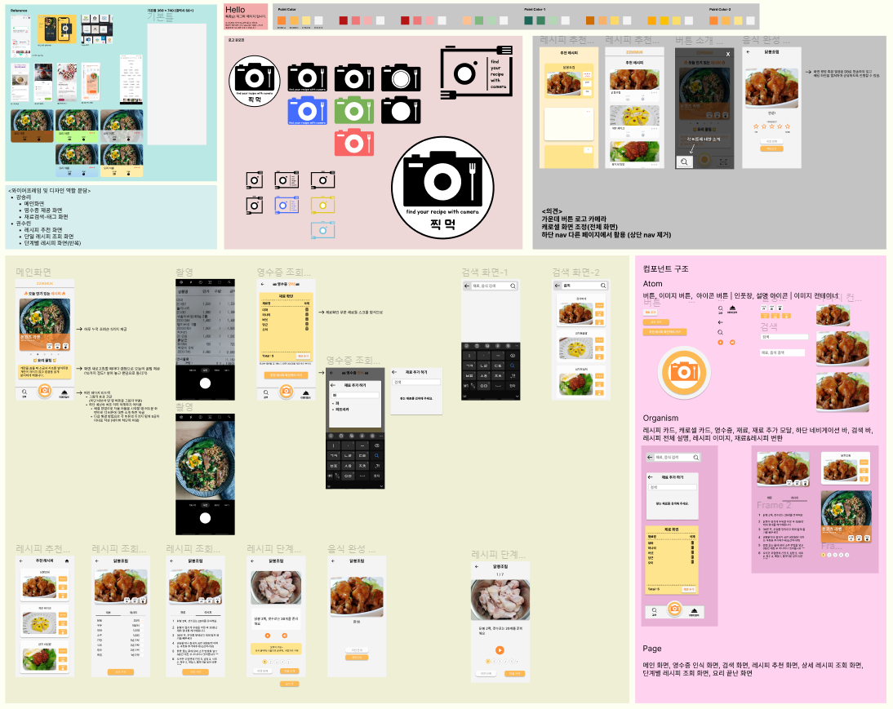

# :sparkles: 찍먹: 찍어먹는 레시피 :fork_and_knife:

##### SSAFY 7기 특화 프로젝트

> 재료를 바탕으로 레시피를 추천하는 Application

 

### :crown: Team A102

팀장: 임수환

팀원: 강승리, 권수린, 성지훈, 신재은

 

---

### 실행방법

1. venv 가상환경 생성: venv 폴더 만들어짐
   `python -m venv venv`
   +) backend 폴더 안에서 생성! `cd backend`
2. venv 가상환경 실행: tab키로 자동완성 가능
   `source venv/Scripts/activate`
3. 터미널에 (venv)로 가상환경 진입된 것 확인
4. 기본 라이브러리 install: requirements.txt 활용(버전까지 지정됨)
   `pip install -r requirements.txt`
5. AI(GCP)를 사용하기 위해 GCP용 service key를 호출
   service.py & key.json이 있는 key 폴더를 receipts 안에 복사
   +) 이외에도 설치 필요한 패키지 있으면 설치한 후 버전 확인하고 `requirements.txt`에 `패키지명==사용버전` 적어서 다음번에는 4번만 하면 되게 만들어놓기
6. DB 확인
   1. db.sqlite3 존재하는지 확인
      1. 없으면 `python manage.py makemigrations` 하고 `python manage.py migrate` 실행
      2. recipes~ 폴더들 생성된 것 확인하고 2, 3 진행
   2. db.sqlite3를 opendb 해서 사용할 reciepes\_ 테이블에 데이터 있는지 확인
   3. 없으면 `db_uploader.py` 주석 해제하고 `python db_uploader.py` 실행
7. 프로젝트 실행
   `python manage.py runserver`
   +) 파일 실행
   `python (실행파일.py)`

 

### application 생성

1. 원하는 앱 이름으로 코드 실행
   `python manage.py startapp (app 이름)`
2. urls, templates(필요시) 따로 생성
   `app_name = '(app 이름)'`: 양식은 recipes/apps.py 참고
   `templates\(app이름)`: 폴더에 index.html 생성, 양식은 base.html 참고
   1. 프로젝트 폴더의 `settings.py`에 INSTALLED_APPS에 앱 이름 추가
   2. 프로젝트 폴더의 `urls.py`에 해당 app의 path 연결
3. runserver해서 페이지 제대로 뜨는지 확인

 

---

## :heart: Front-End

### Front-End 기술스택 및 라이브러리

- 핵심 라이브러리 및 기술 스택
  
  | 라이브러리                         | Version | Comment               |
  | ----------------------------- | ------- | --------------------- |
  | axios                         | ^0.27.2 | 서버로 API 요청을 보내기 위해 사용 |
  | expo                          | ~46.0.9 | 모바일 애플리케이션 빌드를 위해 사용  |
  | vue                           | ^3.2.13 | 소개 홈페이지 제작            |
  | react                         | 18.0.0  | react native를 위해 사용   |
  | react-native                  | 0.69.5  | 모바일 애플리케이션 제작         |
  | expo-speech                   | ~10.3.0 | TTS를 위해 사용            |
  | expo-camera                   | ~12.3.0 | 카메라로 영수증 촬영을 위해 사용    |
  | @react-navigation/bottom-tabs | ^6.4.0  | 메인 페이지에서 화면이동을 위해 사용  |
  | styled-components             | ^5.3.5  | 앱 스타일 컴포넌트 제작을 위해 사용  |

### React Native

- 애플리케이션 개발 이유
  
  - OCR을 이용해 영수증 재료를 수집하여 레시피를 제공해 주는 방식으로 촬영 기능이 필요했습니다.
  
  - 부엌에 태블릿 설치 형식이 아닌 스마트폰을 활용하여 가볍게 레시피를 제공 받을 수 있는 환경을 기대했습니다.

- 모바일 크로스플랫폼 프레임워크를 선택한 이유
  
  - Java / Kotlin 을 학습하여 안드로이드 개발을 진행하는 것보다 React 를 학습하여 React Native 개발을 진행하는 것이 짧은 프로젝트 기간 동안 더 적합하다고 판단했습니다.

- 크로스플랫폼 프레임워크에서 Flutter를 사용하지 않고 React Native를 채택한 이유
  
  - 리액트를 이용해 프로젝트를 한 경험이 있는 팀원이 있어서 구조가 비슷한 리액트 네이티브로 프로젝트를 진행하는 것이 더 효율적이라고 판단했습니다.

### CLI 선택 ( React Native CLI vs Expo CLI)

- Expo cli 선택 이유
  
  - 기능 개발 집중
    
    - 네이티브 앱을 만들기 위해 필요한 파일들이 이미 갖춰져 있어 자바스크립트를 이용한 기능 개발에만 집중할 수 있게 해주는 환경이 중요하다 판단했습니다.
  
  - 빠른 빌드를 통한 개발
    
    - expo 앱을 이용해 빠르게 빌드를 진행하여 쉽게 화면을 확인할 수 있는 부분이 필요하다 생각했습니다.

### 컴포넌트 구조

- 아토믹 디자인 패턴 활용
  
  : 화학적 관점에서 영감을 얻은 디자인 시스템입니다. 단계별로 추상적인 것에서 구체화하는 단계를 통해 컴포넌트를 개발합니다.
  
  

- 기존 아토믹 디자인 패턴을 참고하여 원자 단위에서 유기체를 거쳐 하나의 페이지를 구성하는 컴포넌트 구성으로 진행했습니다.
  
  : 페이지 기획 및 설계를 통해 프로젝트 규모를 파악하여 컴포넌트 단위를 구별했으며 프론트 팀에서 같이 원자, 유기체, 페이지를 구분하여 개발을 진행했습니다.

### 커뮤니케이션

프론트 개발의 효율을 향상시키기 위한 방향.

#### 코드 컨벤션

- 코드 컨벤션의 필요성
  
  - 시간이 지나고 나서도 코드를 다시 확인할 때 편리함을 위함.
  
  - 혼자 개발을 하는 것이 아닌 프론트 팀으로 진행하며 다른 팀원이 코드를 확인하는 데 효율성을 갖기 위함.

- 코드 작성의 통일성
  
  - Prettier 활용
    
    - Prettier를 이용하여 각자 작성한 코드의 포멧을 통일시켜 다른 팀원의 코드를 확인하는 데 가독성을 올릴 수 있었습니다.
  
  - 코드 구조
    
    - 스타일을 가장 밑으로 내려 스타일 적용은 styleSheet을 활용했습니다.
      
      - 스타일 적용 확인을 정리하기 위함.
    
    - 각 변수명은 카멜케이스로 통일 시켰습니다.
    
    - 각 컴포넌트의 함수명은 파스칼케이스로 통일 시켰습니다.
      
      - 변수명이 길어지더라도 카멜케이스를 통해 어떤 역할인지 확인하도록 위함.
      
      - 컴포넌트의 역할을 확인하고 구분하기 위해 파스칼케이스 이용.

#### GitLab 활용

- merge를 하기전 요청을 보내고 approve를 받고 코드리뷰를 받는 형식
  
  - axios 컴포넌트 구조 코드리뷰 파트
    
    

#### Figma 활용

- 피그마를 활용한 전체적인 화면 기획 및 구성 & 컴포넌트 설계 등
  
  

---

## Back-End

### 폴더 구조

#### :blue_heart: backend

##### zzikmuk

- 프로젝트 이름
- 전체 프로젝트와 관련(app 만들때 urls.py에 추가해야함)

##### recipes

- 프로젝트 app1
- 레시피와 관련된 service(list, detail 등)

##### receipts

- 프로젝트 내부 app2
- 영수증 인식과 관련된 service(ocr 등)

 

### 설명

#### :blue_heart: backend

##### Django

- MTV(Model-Template-View) 패턴 프레임워크
- View를 CBV(Class Based View)로 작성
